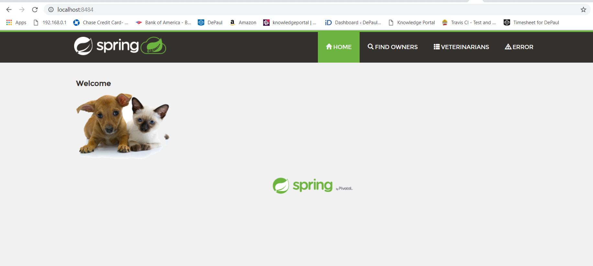

DOCKER
5 pts Your dockerfile. Please provide a link to this file rather than a screen capture.
http://localhost:8484/
5 pts Your running docker instance as shown by a ps command.

5 pts Your browser accessing the main page of the website from your local container.

DOCKER COMPOSE - MYSQL ONLY
5 pts The output from the docker-compose up command.

5 pts Your browser accessing the “Veterinarians” page of the website from your local container when you run the application from the host system.

5 pts A section of the stack trace generated when you attempt to run the application
container that has been updated to use MySQL.

DOCKER COMPOSE - APP SERVER AND MYSQL
5 pts Your updated docker-compose.yml file containing the application server, built from
your local Dockerfile, and the existing MySQL configuration. Please provide a link
to this file rather than a screen capture.

5 pts Your updated application-mysql.properties file containing the URL change for
the database server. Please provide a link to this file rather than a screen capture.

5 pts The output from the docker-compose up command.

5 pts Your browser accessing the “Veterinarians” page of the website from your local container.

